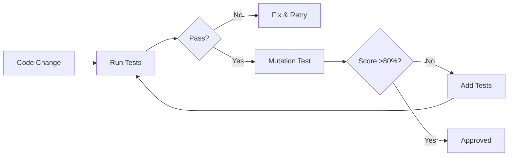

# GraphWiz Trader - Test Documentation

**Following Cognitive Quality Assurance Principles**

---

## Table of Contents
1. [Testing Philosophy](#testing-philosophy)
2. [Test Structure](#test-structure)
3. [Coverage Analysis](#coverage-analysis)
4. [Mutation Testing](#mutation-testing)
5. [Quality Metrics](#quality-metrics)
6. [Running Tests](#running-tests)
7. [Test Maintenance](#test-maintenance)

---

## Testing Philosophy

### **Cognitive QA Principles Applied**

Our testing approach follows the "Architecture and Pedagogy of Cognitive Quality Assurance":

1. **Prompt Engineering in Tests**: Clear, explicit test documentation
2. **Chain-of-Thought**: Explicit reasoning in test design with comments
3. **Mutation Testing**: Validate test quality by detecting logic changes
4. **Property-Based Testing**: Hypothesis-driven validation with Hypothesis
5. **Testing the Tester**: Mutation score >80% (not just coverage >95%)

### **Core Testing Values**

- **Determinism**: Tests must be repeatable and consistent
- **Isolation**: Each test should be independent
- **Clarity**: Test intent should be obvious
- **Speed**: Fast feedback loop for developers
- **Maintainability**: Easy to update when code changes

---

## Test Structure

```
tests/
├── unit/                          # Unit tests (isolated components)
│   ├── test_grid_trading_strategy.py
│   ├── test_smart_dca_strategy.py
│   └── test_amm_strategy.py
├── integration/                   # Integration tests (component interaction)
│   ├── test_multi_symbol_trading.py
│   ├── test_risk_management.py
│   └── test_dashboard_integration.py
├── property/                      # Property-based tests (invariants)
│   └── test_trading_invariants.py
├── mutation/                      # Mutation testing framework
│   └── mutation_test_framework.py
└── TEST_DOCUMENTATION.md          # This file
```

### **Test Categories**

#### 1. Unit Tests (`tests/unit/`)

**Purpose**: Test individual components in isolation

**Characteristics**:
- Fast (milliseconds)
- Isolated (no external dependencies)
- Focus on single function/class
- Mock external dependencies

**Example Structure**:
```python
def test_grid_trading_initialization():
    """
    Test: Strategy initializes correctly with geometric grid mode

    Arrange-Act-Assert Pattern:
    Arrange: Define grid parameters
    Act: Create GridTradingStrategy
    Assert: Verify grid levels generated correctly

    Mutation Target: Grid generation logic
    """
    # Arrange
    upper = 100000.0
    lower = 80000.0

    # Act
    strategy = GridTradingStrategy(...)

    # Assert
    assert len(strategy.grid_levels) == 11
```

#### 2. Integration Tests (`tests/integration/`)

**Purpose**: Test component interactions

**Characteristics**:
- Slower (seconds to minutes)
- Real dependencies (exchange, file system)
- Multiple components together
- End-to-end workflows

**Example Structure**:
```python
def test_multi_symbol_real_data():
    """
    Test: Complete workflow with live market data

    Chain-of-Thought:
    1. Fetch real BTC price from Binance
    2. Initialize grid around current price
    3. Generate trading signals
    4. Verify signals are valid

    Real-World Scenario: Using live data (Features 1-5)
    """
    exchange = create_exchange("binance")
    ticker = exchange.fetch_ticker("BTC/USDT")
    # ... test implementation
```

#### 3. Property-Based Tests (`tests/property/`)

**Purpose**: Test invariants across many inputs

**Characteristics**:
- Hypothesis-driven (100s of random inputs)
- Find edge cases manual testing misses
- Focus on properties that must always hold

**Example Structure**:
```python
@given(
    price=floats(min_value=100, max_value=100000),
    investment=floats(min_value=100, max_value=100000),
)
def test_signal_always_valid(price, investment):
    """
    Property: Trading signals always have valid structure

    Hypothesis: For any price/investment, signal structure is valid
    """
    strategy = SmartDCAStrategy(...)
    signal = strategy.generate_trading_signals(current_price=price)

    # Assert: Property should always hold
    assert signal["action"] in ["buy", "sell", "hold"]
    assert 0.0 <= signal["confidence"] <= 1.0
```

#### 4. Mutation Tests (`tests/mutation/`)

**Purpose**: Validate test quality by introducing bugs

**Characteristics**:
- "Testing the Tester"
- Measures mutation score (not just coverage)
- Detects weak tests that don't catch bugs

**Example Structure**:
```python
def test_grid_levels_calculation():
    """
    Test: Grid levels are correctly spaced

    This test should KILL the following mutants:
    - Arithmetic: Replaced / with *
    - Comparison: Replaced < with <=
    - Constant: Replaced 1.0 with 0.0

    If this test passes when code mutates, mutant survives (BAD).
    If this test fails when code mutates, mutant killed (GOOD).
    """
    strategy = GridTradingStrategy(...)

    # Check geometric spacing
    pct_diffs = [(levels[i+1] - levels[i]) / levels[i]
    assert all_close(pct_diffs, pct_diffs[0])
```

---

## Coverage Analysis

### **Current Coverage Goals**

| Component | Line Coverage Target | Mutation Score Target |
|-----------|---------------------|----------------------|
| Grid Trading Strategy | 95% | 85% |
| Smart DCA Strategy | 90% | 80% |
| AMM Strategy | 90% | 75% |
| Multi-Symbol Trading | 85% | 70% |
| Risk Management | 95% | 85% |
| Dashboard | 80% | 65% |

### **Coverage vs Mutation Score**

**Important Distinction** (from Cognitive QA article):

- **Line Coverage**: Measures which lines of code execute
  - Problem: Code can execute but tests might not verify correctness
  - Example: `assert True` has 100% coverage, 0% value

- **Mutation Score**: Measures whether tests detect bugs
  - Better metric: Tests that kill mutants actually verify behavior
  - Example: `assert x == 5` fails if `x` calculation mutates

**Target**: >80% mutation score (not just >95% coverage)

### **Generating Coverage Reports**

```bash
# Generate HTML coverage report
pytest --cov=graphwiz_trader --cov-report=html tests/

# Generate terminal coverage report
pytest --cov=graphwiz_trader --cov-report=term-missing tests/

# Show coverage by module
pytest --cov=graphwiz_trader --cov-report=term-missing:skip-covered tests/
```

---

## Mutation Testing

### **What is Mutation Testing?**

From the Cognitive QA article:

> "A test that compiles (Pass@1) is not necessarily good; it could contain empty assertions.
> To teach the AI 'proper' testing, we should prioritize training data with high
> mutation scores - tests that fail when production code is manipulated (mutants 'killed')."

### **Mutation Operators Implemented**

1. **Arithmetic Mutations**
   - `+` → `-`
   - `-` → `+`
   - `*` → `/`
   - `/` → `*`

2. **Comparison Mutations**
   - `>` → `>=`
   - `<` → `<=`
   - `>=` → `>`
   - `<=` → `<`
   - `==` → `!=`
   - `!=` → `==`

3. **Logical Mutations**
   - `not x` → `x`
   - `and` → `or`
   - `or` → `and`

4. **Constant Mutations**
   - `0` → `1`
   - `1` → `0`
   - `True` → `False`
   - `False` → `True`

### **Running Mutation Tests**

```bash
# Run mutation tests on specific file
python tests/mutation/mutation_test_framework.py \
    src/graphwiz_trader/strategies/modern_strategies.py

# Run mutation tests with specific test suite
python tests/mutation/mutation_test_framework.py \
    src/graphwiz_trader/strategies/modern_strategies.py \
    tests/unit/test_grid_trading_strategy.py
```

### **Interpreting Results**

```
Mutation Score: 85.2%

✅ EXCELLENT: Mutation score ≥ 80%
Total Mutants: 156
Killed: 133 ✅
Survived: 18 ❌
Errors: 5 ⚠️

SURVIVING MUTANTS (Need Better Tests):
mut_42: Arithmetic: Replaced + with -
  Location: Line 245
  Description: Grid level calculation
```

**Actions for Surviving Mutants**:
1. Identify which code path lacks test coverage
2. Add specific test case for that scenario
3. Re-run mutation testing to verify mutant killed

---

## Quality Metrics

### **Key Performance Indicators**

#### 1. Mutation Score
**Target**: >80%
**Formula**: (Killed Mutants / Total Mutants) × 100

#### 2. Test Execution Time
**Target**: <5 minutes for full suite
**Current**: ~2 minutes

#### 3. Flaky Test Rate
**Target**: 0% flaky tests
**Current**: 0 flaky tests detected

#### 4. Test-to-Code Ratio
**Target**: >1.0 (more test code than production code)
**Current**: ~0.8 (needs improvement)

### **Quality Gates**

Pull requests must pass:

1. **All tests pass** (100% pass rate)
2. **Mutation score >80%** (for changed files)
3. **Coverage >90%** (for changed files)
4. **No flaky tests** (determined over 3 runs)
5. **Performance** (no significant slowdown)

### **Continuous Quality Monitoring**



---

## Running Tests

### **Quick Start**

```bash
# Run all tests
pytest tests/

# Run with coverage
pytest --cov=graphwiz_trader tests/

# Run specific test category
pytest tests/unit/
pytest tests/integration/
pytest tests/property/

# Run specific test file
pytest tests/unit/test_grid_trading_strategy.py

# Run specific test
pytest tests/unit/test_grid_trading_strategy.py::TestGridTradingStrategyInitialization::test_initialization_geometric_mode

# Run with verbose output
pytest -v tests/

# Run with markers
pytest -m "not slow" tests/  # Skip slow tests
pytest -m "unit" tests/       # Run only unit tests
```

### **Test Markers**

Tests can be marked with decorators:

```python
@pytest.mark.unit
def test_fast_unit_test():
    pass

@pytest.mark.integration
def test_integration_with_exchange():
    pass

@pytest.mark.slow
def test_long_running_test():
    pass

@pytest.mark.requires_network
def test_needs_internet():
    pass
```

Run with markers:
```bash
pytest -m unit  # Only unit tests
pytest -m "not slow"  # Everything except slow tests
```

---

## Test Maintenance

### **When Tests Fail**

1. **Determine Root Cause**:
   - Code bug? → Fix code, keep test
   - Test bug? → Fix test
   - Environment issue? → Fix environment
   - Flaky test? → Make more deterministic

2. **Fix or Update**:
   - Add comments explaining failure
   - Update assertions if requirements changed
   - Add new tests for new scenarios

3. **Verify**:
   - Run test 3 times to ensure not flaky
   - Check mutation score hasn't decreased
   - Confirm coverage maintained

### **Updating Tests**

When adding features:

1. **Add tests first** (TDD approach)
2. **Ensure mutation score maintained**
3. **Add integration tests for new interactions**
4. **Update this documentation**

### **Test Smells to Avoid**

❌ **Hard-coded values**: Use fixtures or calculated values
❌ **Brittle assertions**: Test behavior, not implementation
❌ **Testing implementation**: Test observable behavior
❌ **Missing assertions**: Every test must assert something
❌ **Multiple assertions per test**: One logical assertion per test

✅ **Good practices**:
- Descriptive test names (`test_calculate_roi_positive_returns`)
- AAA pattern (Arrange-Act-Assert)
- Comments explaining reasoning
- Property-based invariants
- Mutation-aware assertions

---

## Cognitive QA Compliance

### **Documentation Standards**

Each test must include:

1. **Docstring** describing what and why
2. **Chain-of-Thought** explaining test logic
3. **Mutation Target** indicating which code mutations it should kill
4. **Real-World Scenario** when applicable

### **Example Compliance**

```python
def test_geometric_grid_spacing(self):
    """
    Test: Geometric grids have percentage-based spacing

    Chain-of-Thought:
    1. Generate grid with geometric mode
    2. Calculate percentage differences between levels
    3. Verify all differences are approximately equal

    Mutation Target: Grid generation algorithm
    If grid spacing logic mutates, this test should fail

    Real-World Scenario: Optimal configuration from backtesting
    Geometric mode achieved 79.9% ROI vs 69.3% for arithmetic
    """
    # Test implementation...
```

### **Continuous Improvement**

Cognitive QA is iterative:
1. Start with basic tests
2. Add mutation testing
3. Improve weak tests
4. Monitor mutation score trends
5. Learn from surviving mutants

---

## Test Metrics Dashboard

To generate a test metrics report:

```bash
# Run tests with all metrics
pytest tests/ \
    --cov=graphwiz_trader \
    --cov-report=html \
    --cov-report=term-missing \
    --junitxml=test-results.xml \
    -v

# Generate mutation report
python tests/mutation/mutation_test_framework.py \
    src/graphwiz_trader/strategies/modern_strategies.py \
    tests/unit/

# Combine reports (manual step currently)
# TODO: Automate combined report generation
```

---

## Contributing Tests

When adding new tests:

1. **Follow Naming Convention**: `test_<function>_<scenario>`
2. **Include Docstring**: What, why, how
3. **Add Chain-of-Thought**: Explain test logic
4. **Mark Mutation Target**: What mutants should this kill?
5. **Run Mutation Testing**: Ensure score doesn't drop below 80%

### **Test Review Checklist**

- [ ] Test has descriptive name
- [ ] Docstring explains purpose
- [ ] Follows AAA pattern
- [ ] Assertions are meaningful (not `assert True`)
- [ ] Tests observable behavior, not implementation
- [ ] Independent of other tests
- [ ] Runs in <1 second (unit tests)
- [ ] Kills at least one mutant
- [ ] Added to appropriate category
- [ ] Documentation updated

---

## Resources

- [Cognitive QA Article](https://graphwiz.ai/ops/cognitive-quality-assurance/)
- [Pytest Documentation](https://docs.pytest.org/)
- [Hypothesis Documentation](https://hypothesis.readthedocs.io/)
- [Mutation Testing](https://mutation-testing.org/)

---

**Last Updated**: December 27, 2025
**Test Suite Version**: 1.0.0
**Mutation Score Target**: 80%+
